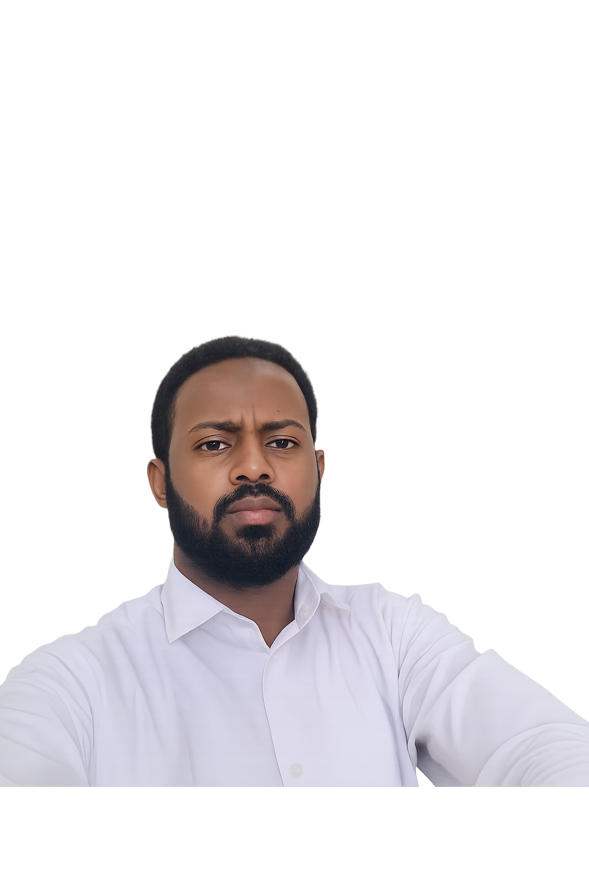

## 👨‍💻 About Me

  

Hi, I'm **Omar Hassan Ali**, a passionate **Frontend Developer** based in **Mogadishu, Somalia**.

I enjoy building modern, responsive, and user-friendly web interfaces using modern frontend technologies.

---

## 🚀 What I Do

- 🌐 Responsive Website Development
- 🎨 Modern UI/UX Interfaces
- ⚡ Frontend Development with React
- 📱 Mobile-Friendly Layouts
- 💼 Dashboard & Portfolio Design

---

## 🛠 Technologies I Use

---

## 📌 Goals

- Become a Professional Full Stack Developer
- Build modern real-world web applications
- Improve React and backend API skills
- Work on impactful digital products

---

## 📬 Contact

### Omar Hassan Ali

- 📧 Email: cumarxasan04@gmail.com
- 📍 Location: Mogadishu, Somalia
- 💻 Frontend Developer
- 🔗 GitHub: https://github.com/omarhassan041
- 🔗 LinkedIn: https://linkedin.com/in/omarhassan041